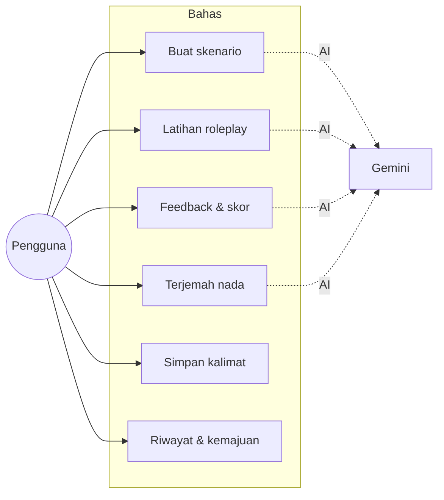
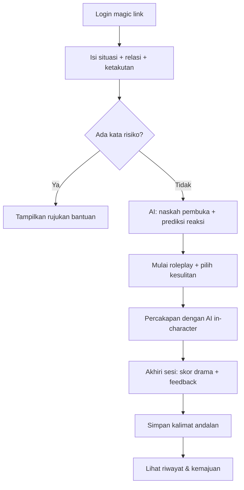
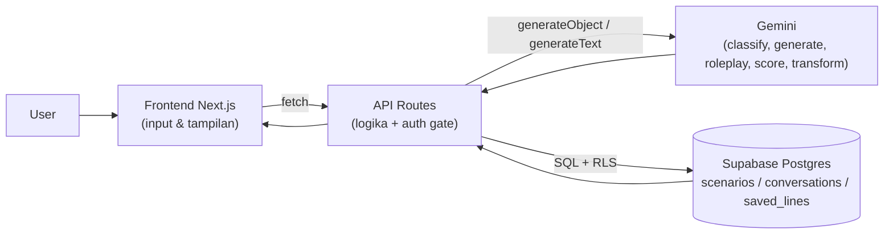
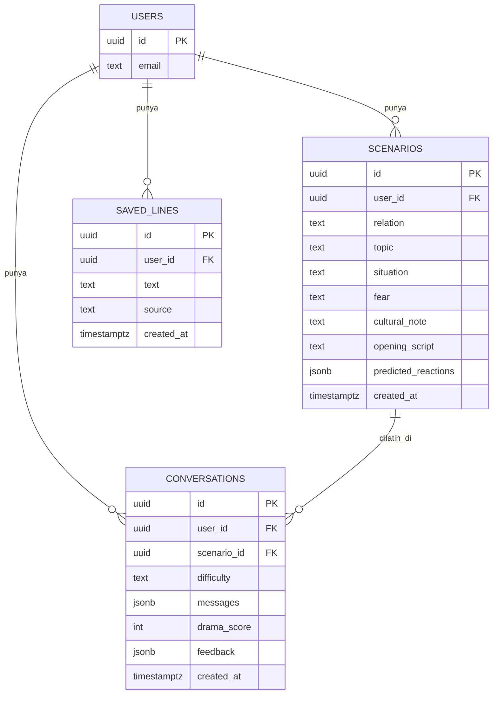

# PRD — Bahas (Single Source of Truth)

> **Bahas** — *Latihan ngobrol uang, sebelum ngobrol beneran.*
> 

> Produk AI untuk melatih percakapan keuangan yang sensitif dengan keluarga/pasangan tanpa berujung drama.
> 

> Dokumen ini adalah **single source of truth**: rujukan tetap untuk AI coding tool agar nama field, fitur, dan arsitektur tidak berubah-ubah.
> 

|  |  |
| --- | --- |
| **Tema** | Literasi Financial |
| **Role** | Hacker — full-stack MVP, deploy publik |
| **Waktu** | Kualitas setara garapan 24 jam — dieksekusi singkat dengan alur AI-assisted |
| **Stack** | Next.js 15 · Supabase · Gemini · Vercel (semua free tier) |

---

## 1. Ringkasan

Uang adalah hal paling emosional untuk dibahas dengan orang terdekat. Banyak keluarga Indonesia "bocor" secara finansial bukan karena tidak tahu cara menabung, tapi karena **obrolan uang yang penting tidak pernah terjadi dengan sehat** — keburu jadi drama, jadi dipendam.

**Bahas** membantu user *menyiapkan, melatih, dan menghaluskan* percakapan uang yang sulit: ceritakan situasi → AI beri strategi + naskah pembuka → latihan roleplay lawan AI yang memerankan orang tua/pasangan → dapat feedback + kalimat andalan yang aman.

---

## 2. Landasan Masalah & Keresahan

Masalah ini datang dari keresahan nyata di komunitas finansial Indonesia. Seorang pengguna r/finansial menulis pertanyaan: *"Bagaimana cara bertanya yang efektif tentang masalah keuangan ke keluarga atau pasangan?"* — karena tiap orang punya perspektif emosional soal uang, dan ada obrolan yang **selalu ada tapi tak pernah mau dibahas**: hutang pribadi/keluarga, warisan yang tak jelas pembagiannya, keluarga yang kurang mandiri tapi minta terus, pasangan beli barang tanpa izin, mindset "rezeki pasti diganti", kebiasaan menyakitkan (judol/rokok), sampai budaya (uang panai, potong tedong).

Kesimpulan penting dari user itu: *"poor would always be poor, and rich could stay rich for some generations"* — salah satunya karena obrolan finansial ini tak pernah terjadi dengan sehat.[[1]](https://www.reddit.com/r/finansial/comments/1n8p1hj/bagaimana_cara_bertanya_yg_efektif_tentang/)

**Empat keresahan inti:**

1. Tidak tahu *cara memulai* obrolan uang yang sensitif tanpa memicu emosi.
2. Takut obrolan berujung drama, jadi dipendam sampai menumpuk.
3. Tidak ada tempat aman untuk *berlatih* sebelum menghadapi orang aslinya.
4. Konteks budaya (gengsi, "rezeki diganti", warisan) bikin obrolan makin buntu.

---

## 3. Insight Kontra-Intuitif ("iya juga ya")

Semua aplikasi literasi finansial mengajarkan **apa yang harus dilakukan dengan uang** — budget, nabung, investasi. **Tidak ada satupun yang menolong bagian tersulit: *percakapannya* dengan orang yang kita sayang.** Padahal di situlah keluarga Indonesia sebenarnya bocor secara finansial.

> Literasi finansial sejati bukan cuma soal angka — tapi soal **keberanian & cara bicara**. Bahas menyerang celah yang dilewatkan semua fintech.
> 

---

## 4. Kenapa Bukan Cukup Pakai ChatGPT/Gemini?

Pertanyaan paling wajar dari juri maupun user: *"Kalau cuma begini, ChatGPT atau Gemini juga bisa jawab — ngapain ada Bahas?"* Justru di sinilah letak produknya.

**Model AI umum bisa *menjawab* soal uang. Bahas bikin kamu *siap dan berani* menghadapinya.** ChatGPT/Gemini itu kotak chat kosong: kamu harus sudah tahu mau nanya apa, harus jago menyusun prompt, dan tiap sesi baru ia lupa kamu siapa. Masalah aslinya bukan "AI nggak bisa jawab" — tapi orang **tidak tahu harus mulai dari mana, tidak punya tempat berlatih, dan tidak dapat ukuran apakah sudah membaik.** Bahas mengubah kemampuan umum itu menjadi latihan yang terpandu, personal, terukur, dan aman.

| Aspek | ChatGPT / Gemini generik | Bahas |
| --- | --- | --- |
| Titik mulai | Kotak kosong — harus sudah tahu mau nanya apa | Form terpandu (situasi + relasi + ketakutan) → naskah otomatis |
| Ingatan | Lupa tiap sesi baru | Simpan skenario, riwayat, & skor drama per user — makin lama makin personal |
| Latihan | Menjawab pertanyaan; sulit konsisten "jadi" lawan bicara | Roleplay in-character + tingkat kesulitan (kalem/emosian), tetap in-character |
| Umpan balik | Tak ada ukuran objektif | Skor drama 0–100 + pemicu/peredam + 1 saran konkret tiap sesi |
| Konteks budaya | Generik/global | Melekat konteks Indonesia (rezeki diganti, gengsi, warisan, uang panai) |
| Keamanan | Bisa keluar jalur / menasihati situasi berbahaya | Deteksi kata risiko → rujukan bantuan; AI dijaga tak berlagak konselor |
| Privasi & progres | Riwayat campur aduk, tak terstruktur | Data privat per user (RLS) + progres terukur antar waktu |

> **Bahas bukan "wrapper" ChatGPT.** Model umum di sini hanya *bahan baku* (lihat poin 13 — AI sebagai fungsi INJECT). Yang menciptakan nilai adalah produk di sekelilingnya: alur terpandu, roleplay adaptif, skor yang bisa dipantau, konteks budaya, guardrail keamanan, dan data yang terakumulasi jadi milikmu. Itu semua yang **tidak** kamu dapat dari kotak chat kosong.
> 

---

## 5. Tujuan & Metrik Keberhasilan

**Tujuan produk:**

- Menolong user *memulai* dan *melatih* percakapan uang yang sulit tanpa berujung drama.
- Menaikkan rasa percaya diri sebelum menghadapi obrolan yang sesungguhnya.
- Menyediakan "kalimat andalan" yang aman & personal untuk dipakai di momen nyata.

**Metrik keberhasilan (fokus demo/MVP):**

| Metrik | Target MVP |
| --- | --- |
| Aktivasi | ≥1 skenario dibuat & ≥1 sesi roleplay selesai per user |
| Kualitas percakapan | Skor drama menurun antar sesi berulang pada skenario sama |
| Nilai nyata | ≥1 kalimat andalan disimpan per user aktif |
| Kualitatif | User merasa "berani mulai ngobrol" setelah latihan |

---

## 6. Target User & Persona

**Rani, 26 tahun** — sudah kerja, tinggal serumah dengan orang tua. Adiknya sering pinjam uang tanpa balikin; pasangannya beberapa kali beli barang mahal tanpa bilang. Rani ingin membahasnya tapi takut berujung drama, jadi dipendam sampai jadi kesal. Ia butuh cara memulai yang aman dan tempat berlatih.

---

## 7. Use Case

**Aktor:** Pengguna (Rani) · AI (Gemini) · Sistem (Supabase Auth + DB).

| ID | Use Case | Aktor | Deskripsi singkat |
| --- | --- | --- | --- |
| UC-01 | Masuk | Pengguna, Sistem | Login via magic link, sesi privat |
| UC-02 | Buat skenario | Pengguna, AI | Isi situasi+relasi+ketakutan → AI klasifikasi & buat naskah |
| UC-03 | Lihat naskah & prediksi reaksi | Pengguna | Baca naskah pembuka + kemungkinan reaksi lawan bicara |
| UC-04 | Latihan roleplay | Pengguna, AI | Ngobrol dengan AI yang memerankan lawan bicara |
| UC-05 | Atur kesulitan | Pengguna | Pilih lawan bicara kalem / emosian |
| UC-06 | Lihat feedback & skor drama | Pengguna, AI | Skor drama + pemicu/peredam + 1 saran |
| UC-07 | Terjemah nada | Pengguna, AI | Ubah pesan emosional → versi sopan tak menuduh |
| UC-08 | Simpan kalimat andalan | Pengguna | Simpan kalimat aman untuk dipakai nanti |
| UC-09 | Lihat riwayat & kemajuan | Pengguna | Pantau pola konflik & penurunan skor drama |
| UC-10 | Rujukan bantuan | Sistem | Deteksi kata risiko → arahkan ke bantuan profesional |



---

## 8. User Stories

**Epik A — Menyiapkan percakapan**

1. Ceritakan situasi + relasi + ketakutan → dapat titik mulai tanpa bingung.
2. Dapat naskah pembuka "no-drama" + prediksi reaksi lawan bicara + saran respons.
3. AI mengenali konteks budaya Indonesia (rezeki diganti, gengsi, warisan, uang panai).

**Epik B — Latihan roleplay (bintang produk)**

1. Berlatih ngobrol dengan AI yang memerankan orang tua/pasangan/saudara yang defensif.
2. Atur tingkat kesulitan lawan bicara (kalem / emosian).
3. Dapat feedback jujur: kalimat mana yang memicu drama & mana yang menenangkan.

**Epik C — Penerjemah nada**

1. Ketik versi emosional → AI tulis ulang jadi versi sopan tak menuduh.

**Epik D — Riwayat & kemajuan (moat)**

1. Simpan "kalimat andalan yang aman" untuk dipakai saat momen sebenarnya.
2. Lihat kemajuan (skor drama menurun) & pola konflik berulang.
3. Semua data privat, hanya bisa diakses pemiliknya.

**Epik E — Batas produk & keamanan**

1. Situasi berat (KDRT/ancaman/judol parah) → diarahkan ke bantuan; AI tidak berlagak jadi penengah/konselor.

---

## 9. Alur Pengguna (User Flow)



---

## 10. Wireframe (Low-Fidelity)

Tiga layar inti. Low-fi, cukup untuk memandu pembangunan UI.

**Layar 1 — Login**

```
+------------------------------------------+
|                 Bahas                    |
|  Latihan ngobrol uang, sebelum beneran   |
|                                          |
|  [ email ______________________ ]        |
|  [   Kirim link login   ]                |
+------------------------------------------+
```

**Layar 2 — Siapkan (form → naskah)**

```
+------------------------------------------+
| [Siapkan] [Latihan] [Terjemah nada]      |
|------------------------------------------|
| Relasi:   ( Orang tua v )                |
| Situasi:  [__________________________]   |
| Ketakutan:[__________________________]   |
|            [  Buat naskah  ]             |
|------------------------------------------|
| Naskah pembuka:                          |
|  "Aku pengen ngobrol soal ..."           |
| Prediksi reaksi:                         |
|  - Reaksi ... -> Saran respons ...       |
|  [ Simpan kalimat ]  [ Latih ini -> ]    |
+------------------------------------------+
```

**Layar 3 — Latihan (roleplay) + Feedback**

```
+------------------------------------------+
| Roleplay: Adik (emosian v)               |
|------------------------------------------|
|  Adik : "Yaelah cuma pinjem doang..."    |
|  Kamu : [__________________________]     |
|              [ Kirim ]                   |
|------------------------------------------|
|  [ Akhiri & minta feedback ]             |
|------------------------------------------|
|  Skor drama: 32/100                      |
|  Pemicu:  ...   Peredam: ...             |
|  Saran:   ...                            |
+------------------------------------------+
```

---

## 11. Ruang Lingkup MVP

**Masuk (wajib demo):**

- Auth (magic link) + data privat per user (RLS).
- Form situasi → naskah pembuka + prediksi reaksi (AI).
- Roleplay chat dengan AI in-character + pilihan kesulitan.
- Feedback pasca-sesi: skor drama + pemicu/peredam + 1 saran.
- Penerjemah nada (de-eskalasi).
- Simpan kalimat andalan.
- Deteksi kata risiko → rujukan bantuan.

**Keluar (nice-to-have, jangan dikerjakan dulu):**

- Grafik kemajuan detail, voice, ekspor PDF, multi-bahasa daerah, notifikasi.

---

## 12. Arsitektur Sistem

Modular — pisahkan concern (Frontend / API / Database), sesuai prinsip "makin modular, makin gampang di-debug".



---

## 13. Pemakaian AI — INJECT (bukan chatbot tempelan)

LLM adalah **fungsi inti**, menggerakkan fitur, bukan sekadar kotak chat. Lima peran:

| Peran | Fungsi | Dipakai di |
| --- | --- | --- |
| **Classify** | Deteksi topik + konteks budaya dari situasi | `analyzeScenario` |
| **Generate** | Susun naskah pembuka + prediksi reaksi | `analyzeScenario` |
| **Act** | Memerankan lawan bicara (roleplay in-character) | `roleplayReply` |
| **Score** | Nilai skor drama + pemicu/peredam + saran | `scoreConversation` |
| **Transform** | Tulis ulang nada emosional → sopan | `rewriteTone` |

**Moat:** riwayat skenario + skor drama + pola konflik terakumulasi per user — makin lama makin personal. ChatGPT/Gemini generik mulai dari nol tiap chat dan tidak menyimpan progres latihanmu.

---

## 14. Data Model & ERD

Tiga tabel, semua terisolasi per user via RLS (`auth.uid() = user_id`).

```sql
scenarios(id, user_id, relation, topic, situation, fear, cultural_note,
          opening_script, predicted_reactions jsonb, created_at)
conversations(id, user_id, scenario_id, difficulty, messages jsonb,
          drama_score int, feedback jsonb, created_at)
saved_lines(id, user_id, text, source, created_at)
```



Detail SQL + policy lengkap ada di halaman **Guide — Bahas (Setup & Kode Lengkap)**.

---

## 15. API Endpoints

| Endpoint | Fungsi | AI |
| --- | --- | --- |
| `POST /api/scenario` | Situasi → naskah + prediksi reaksi, simpan | Classify + Generate |
| `POST /api/roleplay` | Lanjut percakapan roleplay | Act |
| `POST /api/feedback` | Analisis sesi → skor + feedback | Score |
| `POST /api/rewrite` | Tulis ulang nada | Transform |

Semua endpoint **auth-gated** (tolak 401 jika belum login) dan validasi input (400).

---

## 16. Alur Bangun (Vibe Coding Loop)

| Urutan | Tahap | Fokus |
| --- | --- | --- |
| 1 | **FRAME** | Kunci PRD ini sebagai jangkar AI |
| 2 | **SCAFFOLD** | Next.js + Supabase + tabel + auth, deploy skeleton |
| 3 | **INJECT** | `lib/ai.ts` 5 fungsi + 4 API route |
| 4 | **INJECT/UI** | Frontend 3 tab + auth gate |
| 5 | **VERIFY** | Uji FE↔API↔DB, tes data beneran masuk, TDD inti |
| 6 | **HARDEN** | Secrets, RLS, validasi input, rate limit, PI |
| 7 | **SHIP** | Deploy final + commit bermakna + isi [PRD.md](http://PRD.md) |

---

## 17. Strategi Testing (TDD)

- Tulis test gagal dulu, baru implementasi (test-driven).
- Prioritas uji: `checkRisk()` (deteksi kata risiko), parsing output `analyzeScenario` (schema zod valid), dan auth gate route (401 tanpa user).
- Contoh test ada di Guide (vitest).
- Prinsip VERIFY: *"jangan percaya buta"* — buka DB, pastikan data nyata masuk; tes sambungan Frontend ↔ API ↔ DB.

---

## 18. Keamanan (HARDEN Checklist)

- [ ]  Secret hanya di `.env` — tidak di client, tidak di-commit.
- [ ]  RLS menyala di ketiga tabel (tanpa itu DB praktis publik).
- [ ]  Validasi input user di tiap endpoint (400 jika kurang).
- [ ]  Rate limit sederhana per user biar kuota LLM tidak boncos.
- [ ]  Sadar prompt injection: input user tidak boleh mengubah instruksi sistem roleplay.
- [ ]  Deteksi kata risiko → tampilkan rujukan bantuan.

---

## 19. Deploy

- Push ke GitHub (commit kecil bermakna, riwayat rapi).
- Import repo ke **Vercel**, set 3 env var, deploy.
- Di Supabase Auth → URL Configuration, tambahkan domain Vercel sebagai redirect.
- Deploy dari **awal** dan sering; tiap gagal deploy, log-nya umpankan ke AI (AI Debugging Loop).

---

## 20. Pemetaan ke Rubrik IndonesiaNEXT (Hacker)

| Kriteria | Bobot | Cara Bahas memenuhinya |
| --- | --- | --- |
| **Penguasaan kompetensi role** | 30% | Full-stack MVP jalan: FE + API + Supabase + LLM API, deploy publik, commit history, no-hardcode |
| **Pemahaman masalah** | 20% | Landasan dari keresahan nyata r/finansial + konteks budaya Indonesia |
| **Kualitas & kegunaan output** | 20% | Naskah, roleplay, feedback yang benar-benar bisa dipakai; data tersimpan per user |
| **Orisinalitas pendekatan** | 15% | Menyasar *percakapan* uang — celah yang dilewatkan semua fintech |
| **Kejelasan penyampaian** | 15% | Demo runtut: masalah → solusi → pipeline AI → hasil |

---

## 21. Skenario Demo (2 menit)

1. **Hook (masalah):** "Kita semua tahu cara nabung. Yang nggak kita tahu: cara ngomongin uang ke keluarga tanpa berantem."
2. Login magic link → masuk sebagai user nyata.
3. Isi situasi: *"Adik pinjam uang terus tapi nggak balikin"* → AI keluarkan naskah pembuka + prediksi reaksi (tunjukkan AI Classify+Generate).
4. Masuk **roleplay**: AI memerankan adik yang defensif → user latihan (momen "wow").
5. Selesai → tampilkan **skor drama + pemicu/peredam + 1 saran**.
6. Simpan **kalimat andalan**. Tutup: "Semua tersimpan privat, makin sering latihan makin paham polamu."

---

*Halaman pendamping: Guide — Bahas (Setup & Kode Lengkap) untuk langkah teknis dari nol sampai deploy.*