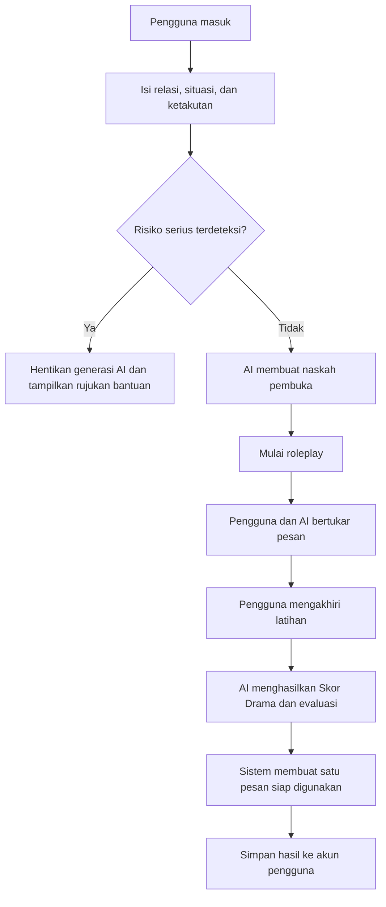
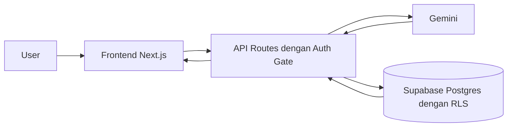

# Product Specification — Bahas

> **Tagline:** Literasi finansial Indonesia bocor bukan karena angka, tapi karena drama.
>
> **Sumber utama:** [`bahas-pitching.pdf`](./bahas-pitching.pdf)
>
> **Status dokumen:** Draft spesifikasi hasil penerjemahan materi pitching

---

## 1. Tujuan Dokumen

Dokumen ini menerjemahkan presentasi Bahas menjadi spesifikasi produk yang dapat dipakai sebagai acuan desain, pengembangan, pengujian, dan evaluasi.

Isi yang dinyatakan langsung dalam presentasi dipertahankan sebagai kebutuhan produk. Detail yang tidak dijelaskan oleh presentasi ditandai sebagai **keputusan implementasi** atau **pertanyaan terbuka**, sehingga tidak dianggap sebagai fakta dari materi pitching.

## 2. Ringkasan Produk

**Bahas** adalah aplikasi latihan komunikasi finansial untuk membantu pengguna mempersiapkan percakapan sensitif mengenai uang dengan keluarga atau pasangan.

Pengguna menceritakan situasi yang dihadapi, berlatih melalui roleplay bersama AI, kemudian menerima evaluasi berupa Skor Drama, pemicu konflik, dan pesan yang dapat digunakan dalam percakapan nyata.

### 2.1 Pernyataan masalah

Masyarakat dapat memahami konsep dasar keuangan, tetapi tetap kesulitan membicarakan persoalan uang dengan orang terdekat. Percakapan tersebut sering ditunda karena takut menimbulkan konflik, rasa tidak enak, gengsi, atau tekanan budaya.

Contoh masalah yang ditampilkan dalam presentasi:

- utang keluarga atau saudara yang tidak dikembalikan;
- pasangan membeli barang mahal tanpa izin;
- keyakinan “rezeki pasti diganti” dan gengsi;
- pembagian warisan yang tidak jelas; dan
- masalah finansial yang dipendam sampai menjadi konflik.

### 2.2 Proposisi nilai

> Aplikasi finansial lain berfokus pada apa yang dilakukan dengan uang. Bahas berfokus pada bagaimana cara membicarakannya.

Bahas tidak diposisikan sebagai chatbot finansial umum. Nilai utamanya adalah alur latihan yang terpandu, roleplay sesuai konteks, evaluasi terstruktur, dan penyimpanan progres per pengguna.

## 3. Sasaran Produk

Bahas harus membantu pengguna untuk:

1. mengubah masalah finansial yang sulit diungkapkan menjadi topik percakapan yang jelas;
2. memperoleh naskah pembuka yang tidak menghakimi;
3. berlatih menghadapi respons orang terdekat sebelum percakapan sebenarnya;
4. mengenali kata atau pola komunikasi yang memicu dan meredakan konflik;
5. menghasilkan satu pesan akhir yang siap digunakan; dan
6. membangun keberanian melalui latihan berulang yang progresnya dapat disimpan.

## 4. Pengguna Sasaran

### 4.1 Pengguna utama

Orang dewasa Indonesia yang perlu membicarakan masalah uang dengan keluarga, pasangan, atau saudara, tetapi khawatir percakapan tersebut akan menimbulkan drama.

### 4.2 Karakteristik pengguna

- Tidak harus memahami cara membuat prompt AI.
- Membutuhkan titik awal percakapan yang praktis.
- Membutuhkan ruang latihan yang privat.
- Menghadapi konteks hubungan dan budaya keluarga Indonesia.
- Menginginkan hasil yang langsung dapat digunakan, bukan teori finansial umum.

### 4.3 Jobs to be done

> Ketika saya harus membicarakan persoalan uang dengan orang terdekat, bantu saya menyusun dan melatih cara bicara yang lebih aman agar saya berani memulai percakapan tanpa memperbesar konflik.

## 5. Ruang Lingkup

### 5.1 MVP

MVP mencakup:

- formulir situasi yang memuat relasi, situasi, dan ketakutan pengguna;
- pembuatan naskah pembuka oleh AI;
- roleplay dasar dengan AI yang memerankan lawan bicara;
- evaluasi akhir berupa Skor Drama 0–100;
- identifikasi pemicu konflik;
- identifikasi unsur yang meredakan konflik;
- pembuatan satu pesan siap ditempel ke WhatsApp;
- penyimpanan skenario dan hasil latihan per pengguna;
- autentikasi sebelum mengakses fungsi privat;
- isolasi data pengguna melalui Row Level Security; dan
- penghentian respons AI serta pemberian rujukan ketika risiko serius terdeteksi.

### 5.2 Roadmap berdasarkan presentasi

Fitur berikut ditempatkan sebagai pengembangan setelah MVP:

- mode demo publik tanpa login;
- dashboard kemajuan; dan
- lawan bicara adaptif dengan *curveball* khas keluarga Indonesia.

> **Resolusi ambiguitas presentasi:** slide “The AI Moat” menampilkan roleplay adaptif sebagai pembeda, sedangkan slide “Progress & Vision” menempatkannya pada roadmap. Dokumen ini memperlakukan roleplay dasar sebagai MVP dan kemampuan adaptif sebagai roadmap.

### 5.3 Di luar ruang lingkup

Bahas bukan:

- aplikasi pencatatan anggaran;
- aplikasi investasi;
- pemberi diagnosis psikologis;
- pengganti konselor;
- mediator resmi untuk konflik keluarga; atau
- layanan darurat.

## 6. Alur Utama Pengguna



## 7. Kebutuhan Fungsional

Prioritas memakai klasifikasi **Must**, **Should**, dan **Could**.

| ID | Kebutuhan | Prioritas |
|---|---|---|
| FR-001 | Sistem harus menyediakan formulir berisi relasi, situasi, dan ketakutan pengguna. | Must |
| FR-002 | Sistem harus menolak pengiriman formulir apabila field wajib kosong atau tidak valid. | Must |
| FR-003 | Sistem harus memeriksa risiko serius sebelum meminta AI menghasilkan konten. | Must |
| FR-004 | Sistem harus menghasilkan naskah pembuka berdasarkan konteks pengguna. | Must |
| FR-005 | Naskah pembuka harus menggunakan bahasa yang tidak menuduh dan diarahkan untuk menurunkan potensi konflik. | Must |
| FR-006 | Pengguna harus dapat memulai sesi roleplay dari skenario yang telah dibuat. | Must |
| FR-007 | AI harus memerankan pihak yang dipilih pengguna dan menjaga konsistensi peran selama sesi. | Must |
| FR-008 | Antarmuka roleplay harus membedakan pesan pengguna dan pesan karakter AI. | Must |
| FR-009 | Pengguna harus dapat mengakhiri sesi dan meminta evaluasi. | Must |
| FR-010 | Sistem harus menghasilkan Skor Drama berupa bilangan 0–100. | Must |
| FR-011 | Sistem harus menampilkan tingkat skor dengan indikator hijau, kuning, atau merah. | Must |
| FR-012 | Sistem harus menampilkan kata atau pola yang memicu konflik. | Must |
| FR-013 | Sistem harus menampilkan kata atau pola yang membantu meredakan konflik. | Must |
| FR-014 | Sistem harus menghasilkan tepat satu pesan ringkas yang siap ditempel ke WhatsApp. | Must |
| FR-015 | Sistem harus menyimpan skenario dan hasil latihan di akun pengguna. | Must |
| FR-016 | Sistem harus membatasi akses data agar pengguna hanya dapat mengakses datanya sendiri. | Must |
| FR-017 | Endpoint privat harus menolak permintaan tanpa sesi autentikasi yang valid. | Must |
| FR-018 | Jika risiko serius terdeteksi, sistem harus menghentikan generasi AI normal dan menampilkan rujukan bantuan profesional. | Must |
| FR-019 | Sistem sebaiknya menyimpan Skor Drama agar dapat dibandingkan pada latihan berikutnya. | Should |
| FR-020 | Sistem sebaiknya mempertahankan konteks budaya keluarga Indonesia pada naskah dan roleplay. | Should |
| FR-021 | Sistem dapat menyediakan mode demo tanpa login yang tidak menyimpan data privat. | Could |
| FR-022 | Sistem dapat menampilkan dashboard perkembangan Skor Drama dari waktu ke waktu. | Could |
| FR-023 | Sistem dapat menyesuaikan respons karakter berdasarkan tingkat ketegangan percakapan. | Could |
| FR-024 | Sistem dapat menyisipkan *curveball* yang relevan dengan dinamika keluarga Indonesia. | Could |

## 8. Spesifikasi Fitur

### 8.1 Ceritakan situasi

**Input minimum:**

- `relation`: hubungan pengguna dengan lawan bicara;
- `situation`: masalah finansial yang ingin dibahas; dan
- `fear`: kekhawatiran pengguna terhadap percakapan tersebut.

**Output:** naskah pembuka yang relevan dengan ketiga input.

**Aturan:**

- pengguna tidak harus menyusun prompt sendiri;
- input kosong tidak boleh dikirim;
- pesan kesalahan harus jelas dan dapat ditindaklanjuti; dan
- pemeriksaan risiko dijalankan sebelum generasi AI.

### 8.2 AI roleplay

**Tujuan:** memberikan ruang latihan sebelum pengguna menghadapi orang yang sebenarnya.

**Perilaku minimum:**

- AI mengambil peran sesuai relasi yang dipilih;
- respons tetap berhubungan dengan skenario;
- AI tidak mengambil alih identitas pengguna;
- AI tidak keluar dari peran untuk memberi ceramah panjang; dan
- percakapan dapat dihentikan pengguna kapan saja.

### 8.3 Feedback dan Skor Drama

**Output minimum:**

- skor bilangan bulat `0–100`;
- kategori visual hijau, kuning, atau merah;
- daftar pemicu konflik;
- daftar peredam konflik; dan
- satu pesan akhir siap digunakan.

**Interpretasi skor:**

| Rentang | Indikator | Makna produk |
|---|---|---|
| 0–33 | Hijau | Risiko drama relatif rendah |
| 34–66 | Kuning | Terdapat bagian yang perlu diperhalus |
| 67–100 | Merah | Risiko konflik relatif tinggi |

> Batas rentang warna merupakan **keputusan implementasi awal**, karena presentasi hanya menetapkan meter hijau, kuning, merah dengan skala 0–100.

Skor Drama adalah evaluasi bantuan AI, bukan ukuran ilmiah, diagnosis, atau jaminan hasil percakapan nyata.

### 8.4 Penyimpanan progres

Sistem harus menyimpan data latihan per pengguna agar sesi tidak hilang seperti percakapan pada chatbot generik.

Data konseptual minimum:

- identitas pemilik data;
- skenario;
- isi atau ringkasan sesi roleplay;
- Skor Drama;
- pemicu dan peredam konflik;
- pesan akhir; dan
- waktu pembuatan.

Nama tabel, kolom, retensi data, dan mekanisme penghapusan belum ditentukan oleh presentasi.

## 9. Kontrak Perilaku AI

### 9.1 Peran AI

AI digunakan untuk:

1. memahami konteks skenario;
2. menghasilkan naskah pembuka;
3. memerankan lawan bicara;
4. mengevaluasi percakapan; dan
5. mengubah hasil latihan menjadi pesan akhir yang praktis.

### 9.2 Batas perilaku

AI harus:

- menggunakan bahasa yang relevan dengan pengguna Indonesia;
- menghindari bahasa yang menghakimi atau mempermalukan;
- tidak mengaku sebagai konselor;
- tidak memberikan kepastian bahwa konflik akan selesai;
- tidak mendorong pengguna menghadapi situasi berbahaya tanpa bantuan; dan
- menghormati penghentian sesi oleh pengguna.

### 9.3 Struktur output minimum

Keluaran evaluasi harus dapat divalidasi sistem dengan struktur konseptual berikut:

```json
{
  "drama_score": 0,
  "conflict_triggers": ["string"],
  "deescalators": ["string"],
  "ready_to_send_message": "string"
}
```

Implementasi harus menolak atau memperbaiki keluaran AI yang tidak sesuai struktur sebelum ditampilkan sebagai hasil final.

## 10. Keamanan dan Responsible AI

### 10.1 Deteksi risiko

Pemeriksaan deterministik harus dilakukan terhadap indikasi risiko serius yang disebutkan dalam presentasi, antara lain:

- KDRT;
- ancaman; dan
- judi online dalam kondisi parah.

Ketika risiko terdeteksi:

1. alur generasi normal dihentikan;
2. pengguna diberi pesan yang tenang dan tidak menghakimi;
3. sistem menjelaskan bahwa Bahas bukan layanan darurat atau konseling; dan
4. sistem menampilkan rujukan bantuan profesional, termasuk SAPA 129 sebagaimana disebutkan dalam presentasi.

Nomor, tautan, jam layanan, dan cakupan rujukan harus diverifikasi sebelum rilis produksi.

### 10.2 Privasi data

- Seluruh data privat harus terikat ke identitas pengguna.
- Tiga tabel Postgres yang digunakan produk harus mengaktifkan Row Level Security.
- Kebijakan akses harus memakai prinsip `auth.uid() = user_id`.
- Kontrol akses tidak boleh hanya bergantung pada penyembunyian data di antarmuka.
- Endpoint privat harus memiliki *auth gate*.
- Secret layanan AI tidak boleh dikirim ke browser.

## 11. Arsitektur Tingkat Tinggi



### 11.1 Tanggung jawab komponen

| Komponen | Tanggung jawab |
|---|---|
| Frontend Next.js | Form input, tampilan roleplay, meter skor, hasil, dan status kesalahan |
| API Routes | Autentikasi, validasi, orkestrasi AI, dan akses database |
| Gemini | Generasi naskah, roleplay, evaluasi, dan transformasi pesan |
| Supabase Postgres | Penyimpanan data privat dan penerapan RLS |
| Vercel | Lingkungan deployment aplikasi dan API |

Gemini dan Supabase dipanggil secara terpisah oleh lapisan API. Supabase bukan bagian yang di-host di dalam Gemini atau sebaliknya.

## 12. Kebutuhan Nonfungsional

| ID | Kebutuhan |
|---|---|
| NFR-001 | Aplikasi harus responsif pada perangkat desktop dan seluler. |
| NFR-002 | Indikator Skor Drama harus dapat dibaca tanpa hanya mengandalkan warna. |
| NFR-003 | Semua input dan output terstruktur harus divalidasi. |
| NFR-004 | Kesalahan layanan AI atau database harus menghasilkan pesan aman, bukan membocorkan detail internal. |
| NFR-005 | Secret dan kredensial layanan harus disimpan sebagai environment variable server. |
| NFR-006 | Data seorang pengguna tidak boleh dapat dibaca atau diubah oleh pengguna lain. |
| NFR-007 | Sistem harus menyediakan status loading dan mencegah pengiriman ganda saat AI sedang memproses. |
| NFR-008 | Sistem harus mencatat kegagalan penting untuk mendukung proses Capture–Feed–Root–Verify. |
| NFR-009 | Bahasa utama produk adalah Bahasa Indonesia yang jelas, empatik, dan tidak menghakimi. |

## 13. Acceptance Criteria

### AC-01 — Membuat naskah pembuka

```gherkin
Given pengguna telah masuk
And pengguna mengisi relasi, situasi, dan ketakutan yang valid
When pengguna meminta naskah
Then sistem memeriksa risiko
And sistem menampilkan naskah pembuka yang relevan
And skenario terhubung ke akun pengguna
```

### AC-02 — Menolak input tidak lengkap

```gherkin
Given pengguna membuka formulir situasi
When salah satu field wajib kosong
Then sistem tidak mengirim permintaan ke AI
And sistem menunjukkan field yang harus diperbaiki
```

### AC-03 — Menjalankan roleplay

```gherkin
Given pengguna memiliki skenario yang valid
When pengguna memulai latihan
Then AI merespons sebagai relasi yang dipilih
And respons tetap sesuai konteks skenario
And pengguna dapat mengakhiri sesi kapan saja
```

### AC-04 — Menghasilkan feedback

```gherkin
Given sesi roleplay memiliki percakapan
When pengguna mengakhiri sesi
Then sistem menampilkan Skor Drama antara 0 dan 100
And sistem menampilkan pemicu konflik
And sistem menampilkan peredam konflik
And sistem menampilkan tepat satu pesan siap digunakan
```

### AC-05 — Menghentikan alur berisiko

```gherkin
Given input mengandung indikasi risiko serius
When sistem menjalankan pemeriksaan risiko
Then sistem tidak melanjutkan generasi AI normal
And sistem menampilkan batas peran Bahas
And sistem menampilkan rujukan bantuan profesional
```

### AC-06 — Isolasi data

```gherkin
Given pengguna A dan pengguna B memiliki data latihan masing-masing
When pengguna A meminta data melalui UI atau API
Then hanya data milik pengguna A yang dapat dibaca atau diubah
And data pengguna B tidak dikembalikan
```

### AC-07 — Auth gate

```gherkin
Given permintaan tidak memiliki sesi yang valid
When permintaan dikirim ke fungsi privat
Then server menolak permintaan
And tidak ada data privat atau secret yang dikembalikan
```

## 14. Kriteria Selesai MVP

MVP dinyatakan siap diuji apabila:

- [ ] alur input → AI → roleplay → feedback → simpan database berjalan end-to-end;
- [ ] semua acceptance criteria berprioritas Must lulus;
- [ ] RLS aktif dan pengujian lintas pengguna membuktikan isolasi data;
- [ ] endpoint privat menolak pengguna tanpa autentikasi;
- [ ] secret AI hanya tersedia di server;
- [ ] deteksi risiko menghentikan alur normal;
- [ ] kegagalan AI dan database ditangani tanpa membocorkan informasi internal;
- [ ] meter Skor Drama menampilkan angka dan kategori visual;
- [ ] hasil akhir berisi satu pesan siap digunakan; dan
- [ ] pengujian produksi terbaru membuktikan alur utama, bukan hanya halaman yang dapat dibuka.

## 15. Indikator Keberhasilan Produk

Presentasi tidak menetapkan target numerik produk. Metrik berikut diusulkan untuk validasi awal:

- persentase pengguna yang menyelesaikan skenario pertama;
- persentase pengguna yang menyelesaikan roleplay;
- persentase sesi yang menghasilkan pesan siap digunakan;
- perubahan rata-rata Skor Drama pada latihan berulang;
- jumlah pengguna yang kembali untuk latihan kedua; dan
- penilaian pengguna terhadap rasa siap atau berani setelah latihan.

Target angka untuk setiap metrik masih harus ditentukan oleh pemilik produk.

## 16. Risiko Produk

| Risiko | Dampak | Mitigasi awal |
|---|---|---|
| Skor dianggap objektif atau ilmiah | Pengguna terlalu percaya pada hasil AI | Jelaskan bahwa skor adalah evaluasi bantuan AI |
| AI keluar dari karakter | Latihan tidak terasa realistis | Batasi peran, konteks, dan panjang respons |
| Respons AI memperburuk situasi berbahaya | Risiko keselamatan pengguna | Pemeriksaan risiko sebelum generasi dan rujukan bantuan |
| Data sensitif terbaca pengguna lain | Pelanggaran privasi | Auth gate, RLS, dan pengujian lintas akun |
| Pengguna menganggap Bahas sebagai konselor | Ekspektasi dan penggunaan yang keliru | Tampilkan batas produk pada titik relevan |
| Ketergantungan pada layanan AI | Fitur utama tidak tersedia saat layanan gagal | Error state, retry terkontrol, dan observability |
| Konteks budaya menjadi stereotip | Output terasa ofensif atau tidak akurat | Gunakan konteks hanya jika relevan dan hindari generalisasi |

## 17. Pertanyaan Terbuka

Hal berikut tidak dijelaskan dalam presentasi dan harus diputuskan sebelum implementasi final:

1. Metode autentikasi apa yang digunakan?
2. Apa nama dan skema pasti dari tiga tabel Postgres?
3. Berapa panjang minimum dan maksimum setiap input?
4. Berapa jumlah giliran maksimum untuk satu sesi roleplay?
5. Bagaimana rumus atau rubrik Skor Drama dijelaskan kepada pengguna?
6. Berapa lama data pengguna disimpan, dan bagaimana pengguna menghapusnya?
7. Apakah percakapan lengkap disimpan atau hanya ringkasannya?
8. Bagaimana rate limit dan pengendalian biaya AI diterapkan?
9. Rujukan bantuan apa saja yang harus ditampilkan selain SAPA 129?
10. Kapan fitur roadmap dipindahkan menjadi bagian dari MVP berikutnya?

## 18. Keterlacakan ke Presentasi

| Slide | Pokok materi | Bagian spesifikasi |
|---|---|---|
| 1 | Premis: literasi finansial bocor karena drama | §2 Ringkasan Produk |
| 2 | Contoh masalah dan landasan keresahan | §2.1 Pernyataan Masalah |
| 3 | Fintech lain vs Bahas | §2.2 Proposisi Nilai |
| 4 | Ceritakan → roleplay → feedback | §6 Alur Utama, §8 Spesifikasi Fitur |
| 5 | Next.js, API Routes, Gemini, Supabase, Vercel | §11 Arsitektur Tingkat Tinggi |
| 6 | AI moat, data per pengguna, roleplay adaptif, Skor Drama | §5 Ruang Lingkup, §9 Kontrak AI |
| 7 | Deteksi risiko, SAPA 129, RLS | §10 Keamanan dan Responsible AI |
| 8 | MVP, hasil nyata, dan roadmap | §5 Ruang Lingkup, §14 Kriteria Selesai |
| 9 | URL produk | Referensi deployment presentasi |
| 10 | Visi: literasi dimulai dari meja makan | Sasaran dan arah produk keseluruhan |

## 19. Catatan Validasi Klaim Pitching

Presentasi memuat klaim angka literasi keuangan, penyebab perceraian, status “MVP live”, dan pipeline yang stabil. Dokumen ini tidak menjadikan klaim tersebut sebagai bukti teknis otomatis.

Sebelum dipublikasikan atau dipresentasikan kembali:

- sumber statistik harus diperiksa dan dicantumkan secara lengkap;
- nomor serta kanal bantuan harus diverifikasi;
- URL deployment harus diuji;
- alur utama produksi harus diuji end-to-end; dan
- penyimpanan serta isolasi data harus dibuktikan melalui pengujian.

---

**Arah produk:** *Ceritakan sekali, latihan sampai berani.*
